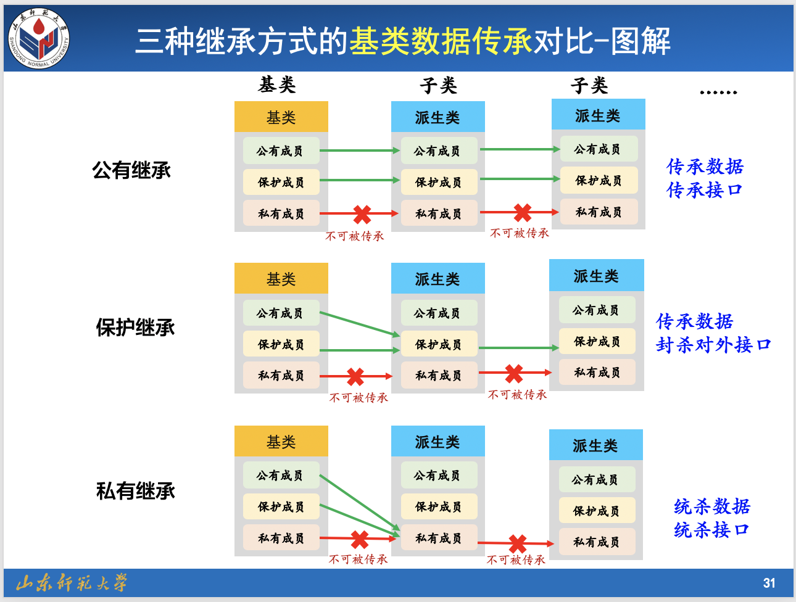

```c++

/*************************************************
** 功能 : 类三种继承的定义形式,三种继承关系的深刻理解 
** 作者 : tsingke
** 时间 : 2019-11-25 / 21:37
***************************************************/

#include <iostream>
#include <cstdlib>
#include <windows.h>

using namespace std;


class A            //作为基类
{
//------------------成员数据------------------

public:
	int a_pub;
protected:
	int a_pro;
private:
	int a_pri;
//------------------成员函数------------------
public:
	A(int pub=0, int pro=0, int pri=0)  //有参构造
	{
		cout << "A() is called" << endl;

		this->a_pub = pub;
		this->a_pro = pro;
		this->a_pri = pri;


	}
	~A()//析构函数
	{
		cout << "~A() is called" << endl;
		getchar();

	}

	void dispaly()
	{
		cout << "基类对象成员数据:" << a_pub << " " << a_pro << " " << a_pri<<endl;
	}


};

//--------------------研究三种不同的继承方式------------------------
class B:public A  //公有继承
{
private:
	int bb;

public:
	B(int b=2):A(2,2,2)
	{
		this->bb = b;
		cout << "B() is called" << endl;
	}
	~B()
	{
		cout << "~B() is called" << endl;
		getchar();

	}

	void display()//探索公有继
	{
		//基类数据传承探索
		a_pub = 200;//a_pub仍为公有数据,子类内可以直接访问
		a_pro = 200;//a_pro仍为保护数据,子类内可以直接访问
		//a_pri = 200;//报错,基类私有成员在子类不可见

		//基类函数传承探索
		A::dispaly();
		cout << "自身添加数据成员: bb = "<<bb << endl;


	}

};

class C: protected A //保护继承
{

private:
	int cc;
public:
	C(int c=3):A(3,3,3)
	{
		cout << "C() is called" << endl;

		this->cc = c;
	}
	~C()
	{
		cout << "~C() is called" << endl;
		getchar();


	}

	void display()//探索保护继承
	{
		//基类数据传承探索
		a_pub = 300;//a_pub变为保护数据,类内可以直接访问
		a_pro = 300;//a_pro变为保护数据,类内可以直接访问
		//a_pri = 300;//报错,基类私有成员在子类不可见

		//基类函数传承探索
		A::dispaly();
		cout << "自身添加数据成员: cc = " << cc << endl;


	}
};

class D : private A  //私有继承
{

private:
	int dd;
public:
	D(int d = 4): A(4, 4, 4)
	{
		cout << "D() is called" << endl;

		this->dd = d;
	}

	~D()
	{
		cout << "~D() is called" << endl;
		getchar();

	}
	void display()//探索私有继承
	{
		//基类数据传承探索
		a_pub = 400;//a_pub变为私有数据,子类内可以直接访问
		a_pro = 400;//a_pro变为私有数据,子类内可以直接访问
		//a_pri = 400;//报错,基类私有成员在子类不可见

		//基类函数传承探索
		A::dispaly();
		cout << "自身添加数据成员: dd = " << dd << endl;


	}
};

/*----------------------------------*
          Main Function
*-----------------------------------*/

int main()
{

	//功能1:通过比较类的大小,证明无论哪种继承方式都会全盘接受基类成员,包括私有的成员

#if 1

	cout << "基类A的大小为: " << sizeof(A) << endl;
	cout << "--类B的大小为: " << sizeof(B) << endl;
	cout << "--类C的大小为: " << sizeof(C) << endl;
	cout << "--类D的大小为: " << sizeof(D) << endl;

	cout << "---------------------------------" << endl;

#endif
	

	//功能2:构造函数和析构函数的调用
#if 1
	A a;
	cout << "---------------" << endl;

	B b;
	cout << "---------------" << endl;


	C c;
	cout << "---------------" << endl;


	D d;
	cout << "---------------" << endl;

#endif

	//功能3:三种继承的使用(类外访问探索)

#if 0
	//------------类B--公有继承--类A---------------
	B b;//派生类B的对象

	  b.a_pub = 200; //正确, 子类内仍然为公有成员,类内外均可访问
	//b.a_pro = 200; //错误,子类内仍然为保护成员,类内可直接访问,类外不可以访问
	//b.a_pri = 200; //错误,基类私有成员在子类内外均不可见

	//b.dispaly();   //正确,访问的是子类自身的公有成员
	//b.A::dispaly();//正确, 子类内函数仍然为公有成员,类内外均可访问

#endif
	
#if 0
	//------------类C--保护继承--类A---------------
	C c;//派生类C的对象
	//c.a_pub = 300;//错误,变为子类保护成员,无法类外直接访问
	//c.a_pro = 300;//错误,变为子类保护成员,无法类外直接访问
	//c.a_pri = 300;//错误,基类私有成员在子类内外均不可见

	//c.display();    //正确,访问的是子类自身的公有成员
	//c.A::dispaly(); //错误,变为子类的保护函数,不可类外访问

	
#endif

#if 0
	//------------类D--私有继承--类A---------------

	D d;//派生类D的对象

	//d.a_pub = 400; //报错,变为子类的私有成员,无法类外直接访问
	//d.a_pro = 400; //报错,变为子类的私有成员,无法类外直接访问
	//d.a_pri = 400; //报错,基类私有成员在子类内外均不可见

	//d.dispaly();    //报错,变为子类私有成员,无法类外直接访问
	//d.A::dispaly(); //错误,变量子类私有函数,无法类外直接访问

#endif
	
	system("pause");
	
	return 0;
}
```
