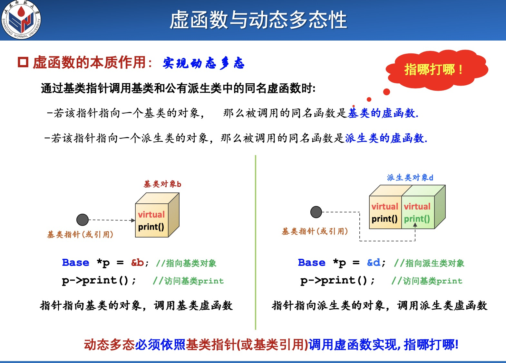

## 动态多态性--代码演示



```c++

/*************************************************
** 功能 : 动态多态性--只要公有继承，长相相同，就能指哪打哪
** 作者 : tsingke
***************************************************/

#include <iostream>
#include <cstdlib>

using namespace std;
class base
{

private:
  int a;
  int b;
  int c;
public:
  base()
  {
    cout<<"base() is called"<<endl;

  }

  virtual void display()
  {
    cout<<"base-display() is called "<<endl;

  }
};

class derive: public base
{
private:
  int x,y,z;
public:
  derive()
  {
    cout<<"derive() is called"<<endl;
  }

  void display()//由于父类同名函数display()为虚函数，因此，子类同名函数自动变为虚函数
    {
      cout<<"derive-display() is called "<<endl;

    }
};


/*----------------------------------*
          Main Function
*-----------------------------------*/

int main()
{


  base father;

  derive son;


  //--------虚函数实现动态多态性---------

  father = son;//赋值兼容性1

  //son = father;//错误， 父类对象不能赋值给派生类对象

  base *p = &son;//赋值兼容性2

  base &r = son;//赋值兼容性3


  father.display();//调用父类函数

  p->display();    //调用子类内的函数（p指向子类对象，调用子类函数）

  r.display();     //调用子类内的函数（r引用子类对象，调用子类函数）


  /*
   * 赋值兼容性存在的问题：无法通过父类指针访问到子类新添加的同名函数
   * 解决方法：在基类内设置同名函数为虚函数，即可实现“指哪打哪”的效果
   **/


  return 0;
}


```
